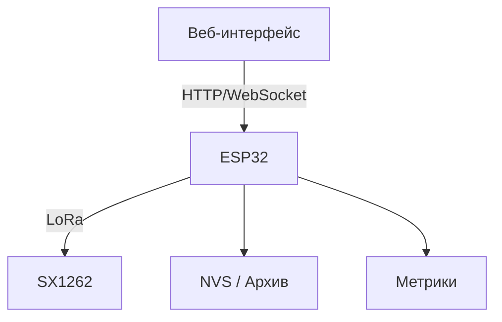

# ESP32 LoRa Pipeline — Track D
- ACK/ретраи, разнос RX/TX, пресеты, метрики, NVS
- Архивация сообщений без ACK с повторной передачей после успешного подтверждения
- AES-CCM (тег 8 B), `ENC/KID/KEY`
- Локальные тесты `ENCTEST`, `ENCTEST_BAD`
- **Персистентный msg_id в NVS** (исключение повторного нонса)
- **Анти-replay** (окно и порог старых ID)
- Модуль `crypto_spec` (в корне проекта) с функциями `setCurrentKey` для хранения ключа и его CRC-16 и `setRootKeyHex` для установки корневого ключа из 32‑символьной hex-строки (по умолчанию загружается встроенное значение)

## Используемые библиотеки
- [Arduino core for ESP32](https://github.com/espressif/arduino-esp32) — базовые классы (`Arduino.h`, `Preferences`, `WiFi`, `WebServer`)
- [RadioLib](https://github.com/jgromes/RadioLib) — драйвер SX1262 и функции LoRa
- [mbedTLS](https://github.com/Mbed-TLS/mbedtls) — криптография (AES‑CCM, ECDH и др.)

### Версии
Все библиотеки помещены в каталог `libs`.
- RadioLib — **v6.0.0**
- mbedTLS — **v2.28.2**
- ESP32 SDK (arduino-esp32) — **v2.0.14**

## Архитектура


## Потоки данных
- **Передача**: веб‑интерфейс → буфер сообщений → фрагментация → шифрование → радио.
- **Приём**: радио → расшифрование → сборка фрагментов → веб‑интерфейс.

## Установка и запуск
### Требования
- Arduino IDE 1.8+ или PlatformIO
- Пакет плат ESP32 (например, `esp32` от Espressif)
- Библиотека [LoRa](https://github.com/sandeepmistry/arduino-LoRa) для Arduino

### Компиляция и прошивка
1. Откройте `ESP32_LoRa_Pipeline.ino` в Arduino IDE.
2. В меню **Tools → Board** выберите **ESP32 Dev Module**.
3. Подключите плату и нажмите **Upload** для компиляции и прошивки.

### Пример запуска
1. После загрузки устройство поднимает точку доступа `ESP32-LoRa`/`12345678`.
2. Подключитесь к Wi‑Fi и откройте в браузере `http://192.168.4.1/` для доступа к веб‑интерфейсу.

### Веб‑интерфейс
- Логи приходят по WebSocket без периодического опроса `/serial`.
- Выбор темы и размер шрифта сохраняются в `localStorage`.
- При отправке сообщений отображается успех или ошибка.
- Макет адаптируется под узкие экраны.
- Рядом с надписью Local/Remote по умолчанию отображаются прочерки, но кнопка **Key Hash** позволяет увидеть 4‑значный хеш текущего ключа и выводит сообщение об ошибке при недоступности сервера.
- В статусной панели мигают индикаторы активности передатчика (TX) и приёмника (RX).
- Все строки чата снабжены временной меткой.
- Кнопки **Ping** и **Metrics** запускают асинхронный пинг и выводят статистику.
- Кнопка **SelfTest** запускает встроенный самотест.
- Дополнительно реализованы функции `ChannelPing`, `PresetPing` и `MassPing` для проверки канала и сканирования пресетов.
- История чата и выбранные параметры сохраняются в `localStorage` и восстанавливаются при перезагрузке страницы.
- Команды **Simple** и **Large** отображают статус выполнения.
- Кнопка **Clean** перенесена в раздел **Appearance** и очищает чат.
- Кнопка **Send** стала компактнее.
- Управление ACK стало явным: чекбокс отправляет состояние на `/setack`.
- Кнопки интерфейса получили разные цвета по уровню значимости.

## Команды
| Команда | Параметры | Назначение | Пример ответа |
|--------|-----------|------------|---------------|
| `ENCTEST [size]` | `size` — размер тестового блока в байтах | Проверка шифрования и дешифрования | `ENCTEST size=32 enc=OK dec=OK time_enc=600us time_dec=700us` |
| `ENCTEST_BAD [size]` | `size` — размер блока | Шифрование с подменой KID, должно завершиться ошибкой | `ENCTESTBAD wrong-KID dec=FAIL (expected FAIL)` |
| `IDRESET [val]` | `val` — новое значение `msg_id` | Установить счётчик сообщений, например для воспроизведения кадров | `*SYS:* msg_id set to 0` |
| `REPLAYCLR` | — | Сбрасывает окно анти‑replay | `*SYS:* replay window cleared` |

Пример использования:

```
> ENCTEST 32
ENCTEST size=32 enc=OK dec=OK time_enc=...us time_dec=...us

> ENCTEST_BAD 32
ENCTESTBAD wrong-KID dec=FAIL (expected FAIL)
```

### Архив сообщений
В буфере сообщений появились методы `archive(msg_id)` и `restoreArchived()`. При превышении числа попыток получения ACK сообщение переносится в архив и не мешает передаче новых пакетов. После получения любого успешного подтверждения одно сообщение возвращается из архива в очередь и будет отправлено первым.

## Структура пакета
Пакеты передачи и приёма имеют общий 14-байтовый заголовок `FrameHeader`:

| Смещение | Поле        | Размер | Описание                                       |
|---------:|-------------|-------:|------------------------------------------------|
| 0        | `ver`       | 1 B    | версия протокола                               |
| 1        | `flags`     | 1 B    | флаги кадра (`ACK`, `ENC`, `FRAG`, `LAST`)      |
| 2        | `msg_id`    | 4 B    | идентификатор сообщения                         |
| 6        | `frag_idx`  | 2 B    | номер текущего фрагмента                        |
| 8        | `frag_cnt`  | 2 B    | общее число фрагментов                          |
| 10       | `payload_len` | 2 B  | длина полезной нагрузки                         |
| 12       | `crc16`     | 2 B    | контрольная сумма заголовка и данных            |
| 14       | `payload`   | N      | полезные данные (зашифрованные или открытые)    |

Такой формат используется как при формировании кадра на отправку, так и при разборе полученных кадров.
Для безопасной работы добавлены функции `FrameHeader::encode()` и `FrameHeader::decode()`
с явным контролем границ и фиксацией порядка байтов.

## Тестирование
Подробное руководство по ручной проверке веб‑интерфейса и радиомодуля описано в [TESTS.md](TESTS.md).
Базовые самотесты шифрования выполняются командами `ENCTEST` и `ENCTEST_BAD`; полный сценарий приведён в `TESTS.md`.
Для валидации частотных пресетов предусмотрен консольный тест `freq_map_test.cpp`,
сравнивающий значения RX/TX с эталоном.

### Локальный тест обмена ключами
Для проверки ECDH без железа добавлен скрипт `run_key_exchange_test.sh`, который компилирует и запускает консольный тест:

```bash
./run_key_exchange_test.sh
```

Скрипт выводит новый `KID` и 16‑байтовый ключ, после чего выполняет короткий тест шифрования.

### Автоматические тесты
Скрипты `run_key_exchange_test.sh`, `freq_map_test.cpp` и `test_web_interface.cpp`
выполняются в CI при каждом пуше.

## Дополнительные инструкции
### Пресеты частот
- Основные пресеты хранятся в `freq_map.h`.
- Переключение банка пресетов: команда `BANK <id>` или выпадающий список в веб‑интерфейсе.
- Для отладки можно запустить тест `freq_map_test.cpp` и убедиться, что значения совпадают с эталоном.

### Переключение конфигураций
- В веб‑интерфейсе предусмотрены профили `High Range`, `Fast Data`, `Balanced`.
- Пользовательский профиль `Custom` позволяет вручную задавать параметры.

### Отладка
- Команда `SelfTest` выполняет внутренние проверки радиоканала и шифрования.
- Логи веб‑интерфейса отражают процесс передачи и помогут найти проблемное место.

## Сценарии использования
### Отправка и приём
1. Подключитесь к точке доступа устройства.
2. Введите сообщение в поле ввода и нажмите **Send**.
3. Ответ появится в области чата с временной меткой.

### Работа с фрагментацией
- Сообщения длиннее MTU автоматически разбиваются на фрагменты.
- Флаг `FRAG` в заголовке показывает, что пакет является фрагментом.

### Демонстрация обмена ключами
1. Запустите `./run_key_exchange_test.sh`.
2. Скрипт сгенерирует пары ключей и проверит шифрование/дешифрование.
