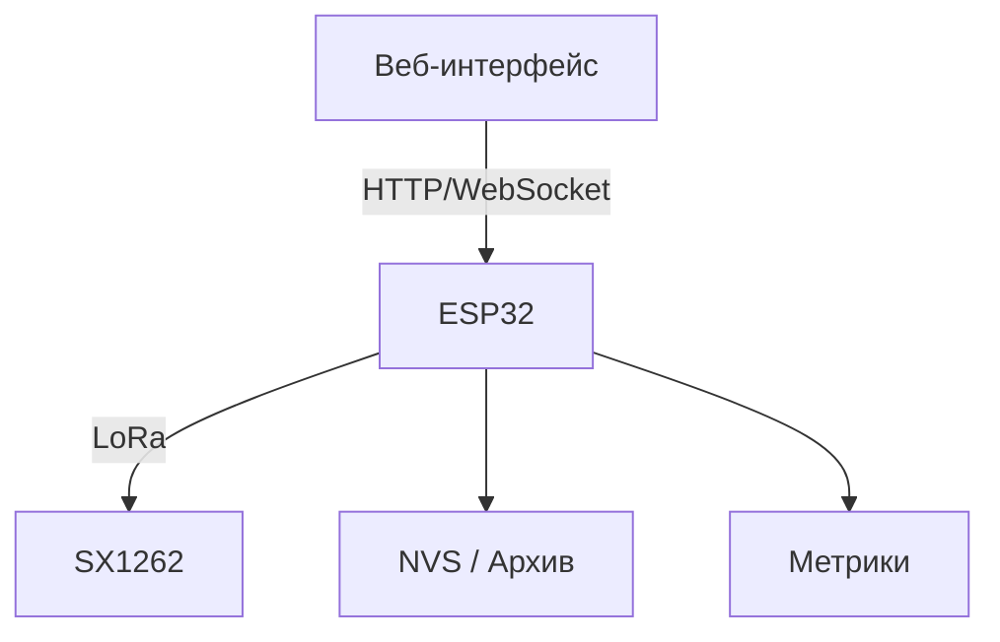

# ESP32 LoRa Pipeline — Track D
- ACK/ретраи, разнос RX/TX, пресеты, метрики, NVS
- Архивация сообщений без ACK с повторной передачей после успешного подтверждения
- AES-CCM (тег 8 B), `ENC/KID/KEY`
- Интерфейс `IEncryptor` поддерживает смену активного KID через `setActiveKid`
- Локальные тесты `ENCTEST`, `ENCTEST_BAD`
- **Персистентный msg_id в NVS** (исключение повторного нонса)
- **Анти-replay** (окно и порог старых ID)
- Модуль `crypto_spec` (в корне проекта) с функциями `setCurrentKey` для хранения ключа и его CRC-16 и `setRootKeyHex` для установки корневого ключа из 32‑символьной hex-строки (по умолчанию загружается встроенное значение)
- Простейший скремблер на LFSR (`lfsr_scramble`/`lfsr_descramble`) для
  избавления от длинных последовательностей бит
- FEC: RS(255,223) + Viterbi K=7, R=1/2, либо LDPC (12,8) и байтовый интерливинг 4–16 байт (`setFecMode`, `setInterleaveDepth`).
- Параметр `setFecMode` принимает значения `off`, `rs_vit` или `ldpc` (исправление одиночных ошибок).
  Глубина интерливера задаётся `setInterleaveDepth` и может быть 1, 4, 8 или 16 байт.
- Модуль `ccsds_link` вставляет синхрометку ASM `0x1ACFFC1D`, выполняет рандомизацию, выбранный FEC и интерливинг и
  предоставляет API `encode()`/`decode()`. FEC применяется после шифрования AES‑CCM.
  Настройки по умолчанию задаются в `config.h` константами
  `CCSDS_FEC_MODE_DEFAULT` и `CCSDS_INTERLEAVER_DEPTH_DEFAULT`.
  - Пилотные вставки с настраиваемым интервалом (`setPilotInterval`, 0=выкл), управляемое дублирование заголовка (`setHeaderDup`) и отдельный CRC заголовка (`hdr_crc`)
- Фрагментация ограничивает полезную нагрузку 64–160 байт
- SR‑ARQ с настраиваемым окном кадров (`setWindowSize`), буфером вне порядка и кумулятивным ACK через `ack_mask`
  - Интервал агрегации ACK настраивается через `setAckAgg`, ACK отправляется каждые 50–100 мс или при заполнении bitmap
  - Процент джиттера ожидания ACK задаётся `setAckJitter`
  - Ступени увеличения таймаута задаются `setBackoff` (список коэффициентов через запятую)
  - После серии до *N* фрагментов передатчик ждёт подтверждение не более `ACK_TIMEOUT`; предел задаётся `setBurstFrags` (поле **Burst**)
- Планировщик слотов TDD (`tdd_scheduler`) с окнами `TX`, `ACK` и защитным интервалом
- Скользящие окна PER/RTT/EbN0 и контроллер профилей `P0–P3`
- Автонастройка профиля по порогам PER/EbN0 (AutoRate)

## Телеметрия канала
- Вкладка **Link Diagnostics** веб‑интерфейса показывает графики PER, RTT и EbN0 и содержит переключатели FEC, интерливера и размера кадра.
- Отображаются текущие настройки профиля и bitmap долгов неподтверждённых кадров.
- Поля `PER High/Low` и `Eb/N0 High/Low` позволяют задать пороги автонастройки; переключатель **AutoRate** включает её.
- При включённой **AutoRate** значение `PER High` или `Eb/N0 Low` переводит устройство на более надёжный профиль, а `PER Low` и `Eb/N0 High` возвращают к более быстрому. Параметры отправляются на `/setautorate`, `/setperth` и `/setebn0th`.
- `FrameLog` фиксирует поля `seq`, `fec_mode`, `interleave`, `frag_size`, `snr_db`, `ebn0_db`, `rssi`,
  `rs_corrections`, `viterbi_metric`, `drop_reason`, `rtt_estimate` для каждого кадра.

## Используемые библиотеки
- [Arduino core for ESP32](https://github.com/espressif/arduino-esp32) — базовые классы (`Arduino.h`, `Preferences`, `WiFi`, `WebServer`)
- [RadioLib](https://github.com/jgromes/RadioLib) — драйвер SX1262 и функции LoRa
- [mbedTLS](https://github.com/Mbed-TLS/mbedtls) — криптография (AES‑CCM, ECDH и др.)
- Собственные реализации RS(255,223) и Viterbi K=7, R=1/2 в каталоге `libs/`

### Версии
Все библиотеки помещены в каталог `libs`.
- RadioLib — **v6.0.0**
- mbedTLS — **v2.28.2**
- ESP32 SDK (arduino-esp32) — **v2.0.14**

### Подключение библиотеки ccsds_link
Библиотека `ccsds_link` использует заголовки `<scrambler.h>`, `<fec.h>` и `<interleaver.h>`
из каталога `libs/ccsds_link`. Для корректной работы требуются также модули
Reed-Solomon, Viterbi и LDPC из подкаталогов `libs/rs`, `libs/viterbi` и `libs/ldpc`.
В Arduino IDE скопируйте каталог `libs` в папку `libraries` вашего скетчбука либо
добавьте его в пути поиска заголовков. После этого подключайте библиотеку так:
`#include "libs/ccsds_link/ccsds_link.h"` — полный путь до заголовка внутри каталога `libs`.

Начиная с этой версии убраны относительные include-пути вроде `../../scrambler.h`,
что устраняет ошибку «No such file or directory» при установке библиотеки в Arduino IDE.
Если такая ошибка всё же появляется, убедитесь, что каталог `libs` полностью
скопирован в папку `libraries` вашего скетчбука Arduino.

## Архитектура


## Потоки данных
- **Передача**: веб‑интерфейс → буфер сообщений → фрагментация → шифрование → радио.
- **Приём**: радио → расшифрование → сборка фрагментов → веб‑интерфейс.

## Установка и запуск
### Требования
- Arduino IDE 1.8+ или PlatformIO
- Пакет плат ESP32 (например, `esp32` от Espressif)
- Библиотека [LoRa](https://github.com/sandeepmistry/arduino-LoRa) для Arduino

### Компиляция и прошивка
1. Откройте `ESP32_LoRa_Pipeline.ino` в Arduino IDE.
2. В меню **Tools → Board** выберите **ESP32 Dev Module**.
3. Подключите плату и нажмите **Upload** для компиляции и прошивки.

### Пример запуска
1. После загрузки устройство поднимает точку доступа `ESP32-LoRa`/`12345678`.
2. Подключитесь к Wi‑Fi и откройте в браузере `http://192.168.4.1/` для доступа к веб‑интерфейсу.

### Веб‑интерфейс
- HTML-страница интерфейса переписана с нуля и сгруппирована по разделам (Basic, Radio, Reliability, Security, Storage, Diagnostics, Link Diagnostics, Commands, QoS, Appearance, Help).
- Логи приходят по WebSocket без периодического опроса `/serial`.
- При разрыве соединения WebSocket автоматически переподключается с экспоненциальной задержкой.
- Для `/send` и `/ping` введён простой rate-limit (200 мс и 1 с).
- Интерфейс покрывает все команды прошивки: ChannelPing, PresetPing, MassPing, управление FEC и интерливингом, загрузку и активацию ключей, IDRESET, REPLAYCLR, работу с архивом и TDD-слотами.
- Выбор темы и размер шрифта сохраняются в `localStorage`.
- При отправке сообщений отображается успех или ошибка.
- Макет адаптируется под узкие экраны.
- Рядом с надписью Local/Remote теперь всегда показывается 4‑значный хеш активного ключа; кнопка **Key Hash** обращается к эндпоинту `/keyhash` и выводит значение либо сообщение «Ключ не задан».
- В статусной панели мигают индикаторы активности передатчика (TX) и приёмника (RX), данные берутся из счётчиков `/linkdiag` в реальном времени.
- Все строки чата снабжены временной меткой.
- Кнопки **Ping** и **Metrics** запускают асинхронный пинг и выводят статистику.
- Кнопка **SelfTest** запускает встроенный самотест.
- Введена вспомогательная функция `on(id,ev,fn)` для безопасного связывания обработчиков, чтобы отсутствие элемента не ломало интерфейс.
- В разделе **Diagnostics** появился блок расширенного SatPing с настройкой числа пакетов, интервала, размера, FEC и повторов.
- В разделе **Diagnostics** добавлены кнопки `ChannelPing`, `PresetPing` и `MassPing` для проверки канала и сканирования пресетов.
- В разделе **Radio** теперь можно выбрать пресет, режим FEC и глубину интерливера.
- Добавлен раздел **Scheduler** с настройкой окон TDD TX/ACK/Guard.
- Раздел **Security (Dev)** содержит кнопки Upload Key, Activate KID, IDRESET и REPLAYCLR.
- Раздел **Archive/Queue** показывает сообщения в архиве и позволяет восстановить одно.
- Раздел **Frames** выводит таблицу последних кадров с фильтром по `drop_reason`.
- История чата и выбранные параметры сохраняются в `localStorage` и восстанавливаются при перезагрузке страницы.
- Окно чата объединяет ленту и поле ввода в единый блок.
- Сообщения выводятся в унифицированном формате `*TAG:* текст` для функций и тестов.
- Для формирования таких строк добавлена функция `chatMsg(tag, text)`.
- Команды **Simple** и **Large** отображают статус выполнения.
- Кнопка **Clean** перенесена в раздел **Appearance** и очищает чат.
- Кнопка **Send** стала компактнее.
- Управление ACK стало явным: чекбокс отправляет состояние на `/setack`.
- Кнопки интерфейса получили разные цвета по уровню значимости.
 - Добавлены переключатели FEC, глубины интерливера и размера полезной нагрузки.
 - Появилось поле для настройки интервала пилотных вставок.
- Добавлены тумблер дублирования заголовка, поле размера окна SR‑ARQ и интервала агрегации ACK.

### HTTP API
- `GET /keyhash` — возвращает 4‑значный хеш активного ключа (`200 text/plain`). Если ключ не установлен, возвращает `404 text/plain` с текстом `no-key`.

### Пакетный режим satping
Добавлена функция `SatPingRun`, позволяющая отправлять серии пакетов с настраиваемыми параметрами и собирать расширенную статистику.
Параметры функции:

- `count` — количество пакетов (0 = бесконечно);
- `interval_ms` — интервал между пакетами;
- `timeout_ms` — таймаут ожидания ответа (по умолчанию 3 с);
- `frag_size` — размер полезной нагрузки в байтах;
- `duration_min` — длительность прогона в минутах, имеет приоритет над `count`.
- `fec_mode` — режим кодирования (`off`, `rs_vit`, `ldpc`, `repeat2`);
- `retries` — количество повторов при отсутствии ответа.

Во время работы выводится телеметрия вида:
`seq=42 frag=0 rtt=640ms snr=7.2dB ebn0=6.0dB fec_corr=12 fec_mode=rs_vit frag_size=32 drop_reason=ok`.
В конце работы выводится сводка: min/avg/p50/p95/max RTT по сообщениям и по отдельным фрагментам, goodput/overhead и счётчики ошибок (CRC, FEC, no-ack, timeout, retransmits). В заголовке отображаются выбранные `fec_mode` и `frag_size`.

Статистика дополнительно содержит:
- `fec_mode` и `frag_size` — параметры запуска;
- `rtt_frag` — список RTT по каждому фрагменту многокадровых сообщений.
В конце подсчитываются 50-й и 95-й перцентили RTT для сообщений и фрагментов.

## Команды
| Команда | Параметры | Назначение | Пример ответа |
|--------|-----------|------------|---------------|
| `ENCTEST [size]` | `size` — размер тестового блока в байтах | Проверка шифрования и дешифрования | `ENCTEST size=32 enc=OK dec=OK time_enc=600us time_dec=700us` |
| `ENCTEST_BAD [size]` | `size` — размер блока | Шифрование с подменой KID, должно завершиться ошибкой | `ENCTESTBAD wrong-KID dec=FAIL (expected FAIL)` |
| `IDRESET [val]` | `val` — новое значение `msg_id` | Установить счётчик сообщений, например для воспроизведения кадров | `*SYS:* msg_id set to 0` |
| `REPLAYCLR` | — | Сбрасывает окно анти‑replay | `*SYS:* replay window cleared` |

Пример использования:

```
> ENCTEST 32
ENCTEST size=32 enc=OK dec=OK time_enc=...us time_dec=...us

> ENCTEST_BAD 32
ENCTESTBAD wrong-KID dec=FAIL (expected FAIL)
```

### Архив сообщений
В буфере сообщений появились методы `archive(msg_id)` и `restoreArchived()`. При превышении числа попыток получения ACK сообщение автоматически переносится в архив и не мешает передаче новых пакетов. После поступления ACK освободившиеся слоты окна заполняются восстановленными из архива сообщениями; каждый восстановленный пакет добавляется в начало соответствующей очереди и будет отправлен с приоритетом.

### SR‑ARQ
Передатчик держит окно из W неподтверждённых кадров и для каждого запускает
собственный таймер ожидания ACK. После серии из `setBurstFrags(N)` фрагментов
(устанавливается через `/setburst`) передатчик делает паузу на `ACK_TIMEOUT` и ждёт подтверждение. Базовый таймаут
1500 мс рандомизируется на ±`AckJitter` % и растёт по коэффициентам `Backoff`
(например, 1.0→1.5→2.0).
Приёмник отправляет кумулятивные подтверждения: в заголовке `ack_mask`
передаётся bitmap последних W кадров и пакеты ACK шлются пачкой каждые 50–100 мс
или при заполнении bitmap. Кадры, пришедшие вне порядка, складываются во
внутренний буфер и выдаются вверх только по возрастанию `msg_id`.

### Ротация ключей и восстановление Nonce
- Загрузите новый ключ через `setKey` с уникальным KID на обеих сторонах.
- Инициатор отправляет уведомление `KEYCHG <kid>` через `TxPipeline::queueKeyChange()` и сообщает `RxPipeline::expectKeyAck(kid)`.
- Получатель при приёме `KEYCHG` немедленно отвечает `KEYACK <kid>` и ждёт финального подтверждения.
- Получив первый `KEYACK`, инициатор активирует ключ (`setActiveKid`) и расссылает завершающий `KEYACK <kid>`.
- Получатель активирует ключ только после получения завершающего `KEYACK`.
- Для исключения повторов Nonce сбросьте `msg_id` или восстановите его из NVS.
- При рассинхронизации счётчиков используйте команду `IDRESET`.
- Процедура `rotateKeyWithAck(newKey,kid,retries)` выполняет те же шаги с зашифрованным подтверждением
  «ключ применён» и повторяет рассылку до `retries` раз при отсутствии подтверждения.

## Структура кадра
Кадр начинается с **двойного заголовка** `FrameHeader`, который передаётся дважды для неравномерной защиты. После уникального слова каждые ~64 байта полезной нагрузки вставляется короткий пилот `0x55 0x2D` для корректировки фазы на приёмнике. Суммарная структура кадра:

- `[Header||HeaderCRC]` ×2 — UEP методом повторной передачи и объединением на приёмнике;
- полезная нагрузка с пилотами через каждые 64 байта.

После удаления пилотов полезные данные обрабатываются как раньше. Пилоты разбираются функцией `updatePhaseFromPilot` в `RxPipeline`.

Пакеты передачи и приёма имеют общий 20-байтовый заголовок `FrameHeader`:

| Смещение | Поле          | Размер | Описание                                       |
|---------:|---------------|-------:|------------------------------------------------|
| 0        | `ver`         | 1 B    | версия протокола                               |
| 1        | `flags`       | 1 B    | флаги кадра (`ACK`, `ENC`, `FRAG`, `LAST`)      |
| 2        | `msg_id`      | 4 B    | идентификатор сообщения                         |
| 6        | `frag_idx`    | 2 B    | номер текущего фрагмента                        |
| 8        | `frag_cnt`    | 2 B    | общее число фрагментов                          |
| 10       | `payload_len` | 2 B    | длина полезной нагрузки                         |
| 12       | `ack_mask`    | 4 B    | маска подтверждённых сообщений                  |
| 16       | `hdr_crc`     | 2 B    | CRC только заголовка                           |
| 18       | `frame_crc`   | 2 B    | CRC заголовка и полезной части                  |
| 20       | `payload`     | N      | полезные данные (зашифрованные или открытые)    |

Такой формат используется как при формировании кадра на отправку, так и при разборе полученных кадров.
Для безопасной работы добавлены функции `FrameHeader::encode()` и `FrameHeader::decode()`
с явным контролем границ и фиксацией порядка байтов.

## Тестирование
Подробное руководство по ручной проверке веб‑интерфейса и радиомодуля описано в [TESTS.md](TESTS.md).
Базовые самотесты шифрования выполняются командами `ENCTEST` и `ENCTEST_BAD`; полный сценарий приведён в `TESTS.md`.
Для валидации частотных пресетов предусмотрен консольный тест `freq_map_test.cpp`,
сравнивающий значения RX/TX с эталоном.

### Локальный тест обмена ключами
Для проверки ECDH и ротации ключа без железа добавлен скрипт `run_key_exchange_test.sh`,
который компилирует и запускает консольные тесты полной цепочки:
генерация → рассылка → подтверждение → активация.

```bash
./run_key_exchange_test.sh
```

Скрипт выводит новый `KID` и 16‑байтовый ключ, затем демонстрирует рассылку,
зашифрованное подтверждение и активацию.

### Автоматические тесты
Скрипты `run_key_exchange_test.sh`, `freq_map_test.cpp`, `tx_profile_test.cpp`, `archive_restore_test.cpp` и `test_web_interface.cpp`
выполняются в CI при каждом пуше.

Заглушки Arduino для хостовой сборки теперь поддерживают конструкторы `String` из числовых типов,
что упрощает локальное тестирование.

## Дополнительные инструкции
### Пресеты частот
- Основные пресеты хранятся в `freq_map.h`.
- Переключение банка пресетов: команда `BANK <id>` или выпадающий список в веб‑интерфейсе.
- Для отладки можно запустить тест `freq_map_test.cpp` и убедиться, что значения совпадают с эталоном.

### Переключение конфигураций
- В веб‑интерфейсе предусмотрены профили `High Range`, `Fast Data`, `Balanced`.
- Пользовательский профиль `Custom` позволяет вручную задавать параметры.

### Адаптивные профили P0–P3
Передатчик автоматически выбирает один из профилей в зависимости от скользящих метрик PER и Eb/N0. 
Во всех профилях полезная нагрузка ограничена диапазоном 64–160 байт:

| Профиль | Условие | `payload_len` | `fec_mode` | `interleave_depth` | `repeat_count` |
|---------|---------|---------------|-----------|--------------------|----------------|
| P0 | PER ≤ 0.1 и Eb/N0 ≥ 7 дБ | 160 | off    | 1  | 1 |
| P1 | PER ≤ 0.2 и Eb/N0 ≥ 5 дБ | 128 | off    | 1  | 2 |
| P2 | PER ≤ 0.3 и Eb/N0 ≥ 3 дБ | 96  | rs_vit | 8  | 3 |
| P3 | иначе                     | 64  | rs_vit | 16 | 4 |

Для доступа к последним измеренным значениям доступны функции `Radio_getSNR`/`Radio_getEbN0`/`Radio_getLinkQuality` и их сокращённые версии `Radio_readSNR`/`Radio_readEbN0`/`Radio_readLinkQuality`.

### TDD расписание
- Параметры окон `TDD_TX_WINDOW_MS`, `TDD_ACK_WINDOW_MS` и `TDD_GUARD_MS` заданы в `config.h`.
- Модуль `tdd_scheduler` использует их для переключения передачи и приёма.

### Отладка
- Команда `SelfTest` выполняет внутренние проверки радиоканала, шифрования и архива сообщений.
- Логи веб‑интерфейса отражают процесс передачи и помогут найти проблемное место.

## Сценарии использования
### Отправка и приём
1. Подключитесь к точке доступа устройства.
2. Введите сообщение в поле ввода и нажмите **Send**.
3. Ответ появится в области чата с временной меткой.

### Работа с фрагментацией
- Сообщения длиннее MTU автоматически разбиваются на фрагменты.
- Флаг `FRAG` в заголовке показывает, что пакет является фрагментом.

### Демонстрация обмена ключами
1. Запустите `./run_key_exchange_test.sh`.
2. Скрипт сгенерирует пары ключей и проверит шифрование/дешифрование.
